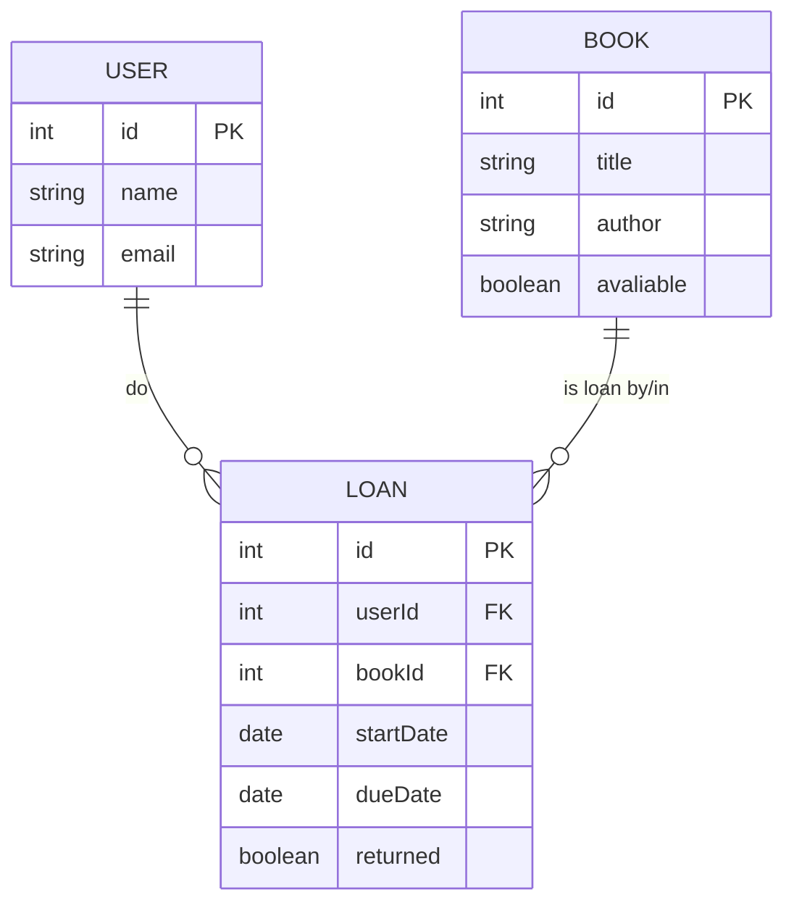

# Projeto Biblioteca API JSON

## 1. Identificação do Projeto

- **Nome do Projeto:** Biblioteca APP
- **Descrição:** Aplicativo móvel multiplataforma (Flutter) para gerenciamento de bibliotecas com funcionalidades do CRUD (Criar, Ler, Atuaizar e Deletar) para usuários, livros e empréstimos.

## 2. Propósito e Escopo

O sistema tem como objetivo digitalizar e simplificar a gestão de acervos bibliotecários. Ele permite o cadastro e controle de livros, usuários e empréstimos, oferecendo uma interface intuitiva para administradores.

O escopo atual inclui operações básicas de gereciamento de dados persistidos em um backend simulado via json-server.

## 3. Requisitos do sistema

### 3.1 Requisitos funcionais (RF)

| ID | Requisito | Descrição |
| - | - | - |
| RF01 | Gerenciar livros | Listar. cadastrar, editar e excluir livros do acervo |
| RF02 | Gerenciar usuários | Listar, cadastrar, editar e excluir usuários do sistema |
| RF03 | Gerenciar empréstimos de livros | Visualizar e gerenciar empréstimos de livros |
| RF04 | Navegação | Interface com navegação por abas (livros, empréstimos, usuários) |

### 3.2 Requisitos não funcionais (RNF)

| ID | Requisito | Descrição |
| - | - | - |
| RF01 | Arquitetura | Baseada em camadas (Model, Service, Controller, View) seguindo o padrão MVC |
| RF02 | Persistência | Utiliza um arquivo db.json como fonte de dados acessando via APIREST (json-server) |
| RF03 | Tecnologia | Desenvolvimento em flutter/dart, com consumo de API via pacote http |
| RF04 | Comunicação | A comunicação com o backend é feita atráves de requisições http síncronas (GET, POST, PUT, DELETE) |

## 4. EndPoint da API (BackEnd)

| Método | EndPoint | Descrição |
| - | - | - |
| GET | /users | Listar todos os usuários |
| GET | /users/{id} | Busca um usuário pelo id |
| POST | /users | Criar um novo usuário |
| PUT | /users/{id} | Atualiza um usuário |
| DELETE | /users/{id} | Remove o usuário |
| GET | /books | Listar todos os livros |
| GET | /books/{id} | Busca um livro pelo id |
| POST | /books | Criar um novo livro |
| PUT | /books/{id} | Atualiza um livro |
| DELETE | /books/{id} | Remove o livro |
| GET | /loans | Listar todos os empréstimos |
| GET | /loans/{id} | Busca um empréstmo pelo id |
| POST | /loans | Criar um novo empréstimo |

## 5. Diagramas

### 5.1 Diagrama de Entidades Relacionais (DER)

### 5.1 Diagrama de Classe

```mermaid
classDiagram
    class UserModel{
        -String? id
        -String name
        -String email
        +toMap() Map
        +fromMap(Map map) UserModel
    }

    class BookModel{
        -String? id
        -String title
        -String author
        -bool avaliable
        +toMap() Map
        +fromMap(Map map) BookModel
    }

    class LoanModel{
        -String? id
        -UserModel user
        -BookModel book
        -DateTime startDate
        -DateTime dueDate
        -bool returned
        +toMap() Map
        +fromMap(Map map) LoanModel
    }

    class ApiService{
        <<static>>
        -String _baseUrl
        +getList(String path) Future<List>
        +getOne(String path, String id) Future<Map>
        +post(String path, Map Body) Future<Map>
        +put(String path, Map Body, String id) Future<Map>
        +delete(String path, String id) void
    }

    class UserController{
        +getUsuarios()
        +postUsuarios()
        +putUsuario(String id)
        +deleteUsuario(String id)
    }

    class BookController{
        +getBooks()
        +postBooks()
        +putBook(String id)
        +deleteBook(String id)
    }
    
    class LoanController{
        +getLoans()
        +postLoans()
        +putLoan(String id)
    }
```

