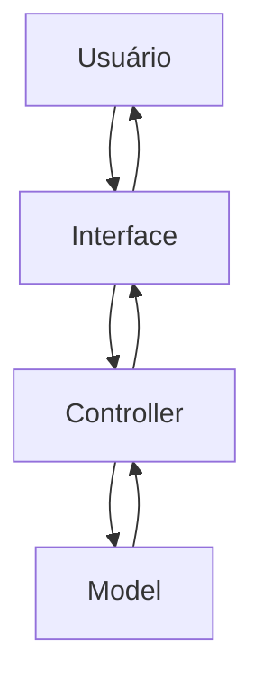
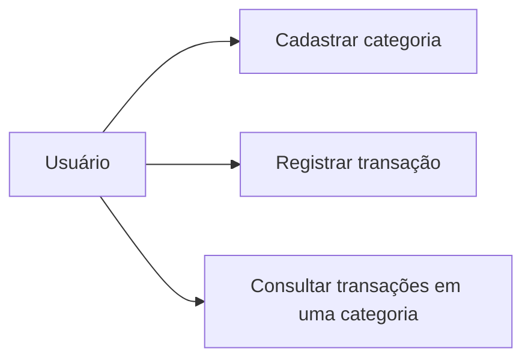
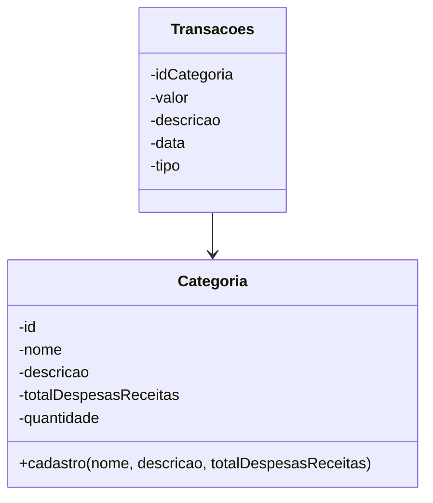

# Documentação de Especificações de Requisitos de Software (SRS)

## Aplicativo de Controle Financeiro Pessoal ()

**Padrão Internacional:** ISO/IEC/IEEE 29148:2018 \
**Versão:** 1.0.0 \
**Data:** 2026-06-11 \
**Autor:** Thayssa Maneo

---

## 1. Introdução

### 1.1 Propósito

Este documento visa descrever os requitos do aplicativo ---, com o objetivo de:

- Definir funcionalidades e restrições;
- Padronizar o entendimento entre os stakeholders;
- Servir como base para desenvolvimento e teste;

---

### 1.2 Escopo

O aplicativo permitirá:

- Cadastro de categorias personalizadas;
- Registro de transações em cada categoria;
- Visualização dos registros por categoria;

O aplicativo será uma aplicação mobile utilizando:

- Framework Flutter;
- Dart;

Objetivos:

Criar um aplicativo de controle financeiro que seja intuitivo para o registro de transações financeiras e controle das mesmas.

---

### 1.3 Definições e Acrônimos

Tabela de termos e tefinições:

| Termos | Definições |
|-|-|
| Categoria | Nome fornecido a um grupo que compartilha as mesmas características |
| Transações | Movimentações de recursos financeiros entre dois meios (contas, agentes econômicos, etc) |

Lista de Acrônimos

- **ACF:** Aplicativo de Controle Financeiro
- **RF:** Requisitos Funcionais
- **RNF:** Requisitos Não Funcionais
- **UC:** Casos de Uso
- **CA:** Critérios de Aceitação

---

### 1.4 Visão geral do documento

Este documento está organizado em:

- Introdução e Visão Geral
- Descrição do Sistema
- Requisitos Detalhados
- Modelos UML
- Regras de Négocio

---

## 2. Descrição Geral do Sistema

### 2.1 Perspectiva do Sistema

O Sistema é mobile, operando em dispositivos móveis.

---

### 2.2 Funções do Sistema

O Sistema deve:

* Cadastrar categorias;
* Registrar transações por categoria;
* Exibir dados;
  
---

### 2.3 Ambiente Operacional

* Dispositivos móveis (Smartphones, tablets)

---

### 2.4 Restrições

* Sem autenticação;
* Sem exclusão de categorias ou registros

---

### 2.5 Suposições

* Usuário possui conhecimento de Informática;

---

## 3. Requisitos do Sistema

### 3.1 Requisitos funcionais

#### RF-01: Cadastro de Categorias

**Descrição:** Permitir cadastrar uma categoria de receita ou despesa.
- Prioridade: Alta
- Versão: 1.0
- Data: 2026-06-11
- Rastreabilidade: Necessidade do Stakeholder 01

**Critérios de aceitação** \
[] Entrada de dados: Nome da categoria, descrição, total de despesas/receitas em um periodo \
[] Validação dos campos \
[] Verificação de duplicidade

#### RF-02: Registro de transações por categoria

**Descrição:** Permitir o registro de transações em cada categoria.
- Prioridade: Alta
- Versão: 1.0
- Data: 2026-06-11
- Rastreabilidade: Necessidade do Stakeholder 02

**Critérios de aceitação** \
[] Entrada de Dados: Nome, Categoria, valor, descrição, data e tipo (despesa/receita). \
[] Validação de Campos \
[] Saída: Notificação para o usuário

#### RF-03: Listagem das transações feitas em cada categoria

**Descrição:** Exibir em cada categoria as transações feitas em um período.
- Prioridade: Alta
- Versão: 1.0
- Data: 2026-06-11
- Rastreabilidade: Necessidade do Stakeholder 03

**Critérios de aceitação**\
[] Listagem de transações\
[] Saída: Categoria, valor, descrição, data e tipo

---

### 3.2 Requisitos Não Funcionais

#### RNF-001: Usabilidade
**Descrição:** Interface Simples e Intuitiva.

#### RNF-002: Desempenho
**Descrição:** Respostas Rápidas e Inferiores a 1 Segundo.

#### RNF-002: Arquitetura de Software MVC
**Descrição:** Estrutura da Arquitetura de Códigos em Padrão MVC (Model, View, Controller).

#### RNF-002: Confiabilidade
**Descrição:** Validação de Entrada de Dados Obrigatória.

---

## Regras do Negócio

Tabela de Regras
|Regras de Negócio|Descrição|
|-|-|
| RN-01 | Toda transação precisa pertencer a uma categoria |
| RN-02 | O período exibido deve ser de no mínimo 3 meses |

**Adicionar as restrições no final**

## 5. Modelos do Sistema

### 5.1 Diagrama de Casos de Uso

Diagrama de casos de uso: O que o sistema deve fazer do ponto de vista do usuário.

---

### 5.2 Diagrama de Classes UML

Diagrama de Classe UML: Estrutura do código, classes, atributos e métodos

---

## 6. Análise de Risco

| Risco | Impacto | Mitigação |
| - | - | - |
| Perda de Dados | Alto | Usar banco de dados |
| Entrada de Dados | Médio | Validar as Entradas de Dados |

---
## 7. Controle de Versões

### 7.1 Histórico de Alterações

| Versão | Data | Autor | Modificação |
|-|-|-|-|
| 1.0.0 | 2026-06-11 | Thayssa Maneo | Versão Inicial |
