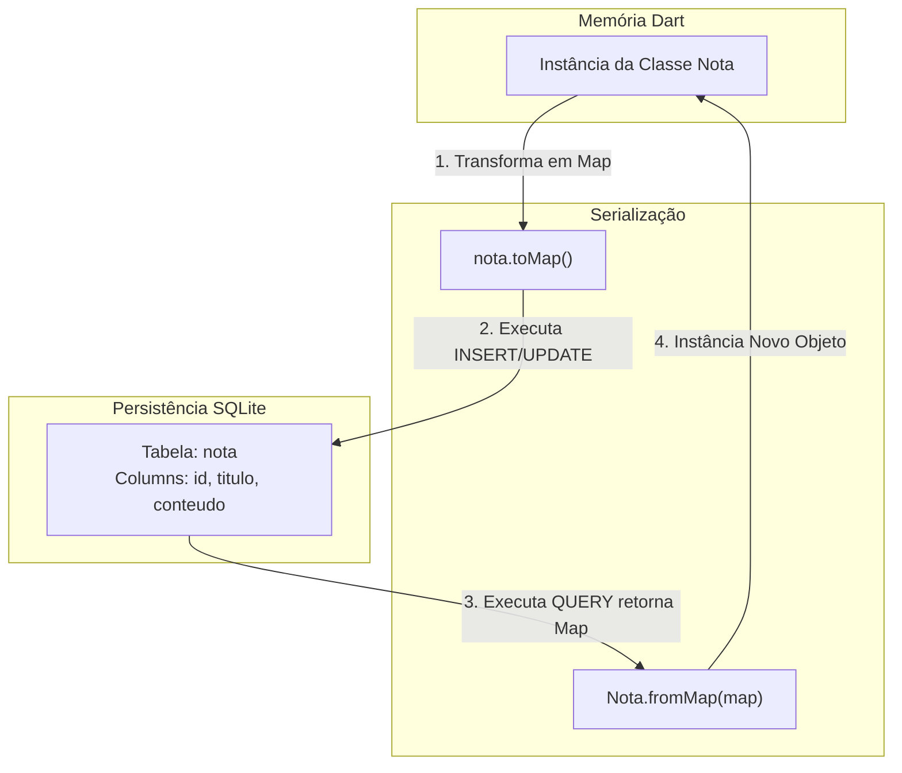
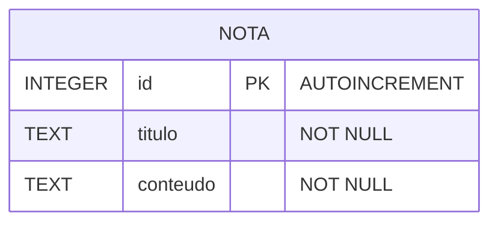

# Documentação de Arquitetura e Modelagem de Persistência Local (Armazenamento Local)

Este documento descreve as decisões de modelagem de dados e o fluxo de persistência local utilizando o pacote `sqlfite` integrado ao ecossistema Flutter.

---

## 1. Mapeamento Objetivo-Relacional (ORM)

O `sqlfite` se comunica nativamente com dados estruturados na forma de pares de Linha/Coluna (`Map<String, dynamic>`). Abaixo, o diagrama ilustra o ciclo de vida e a transformação sofrida pelo dado desde a memória da aplicação (Objeto) até o disco de armazenamento (Tabela SQLite):

**Modelagem de Entidade e Relacionamento (MER)**

O banco de dados SQLite armazena a estrutura da tabela utilizando restrições (constraints) e tipos primitivos de dados relacionais

