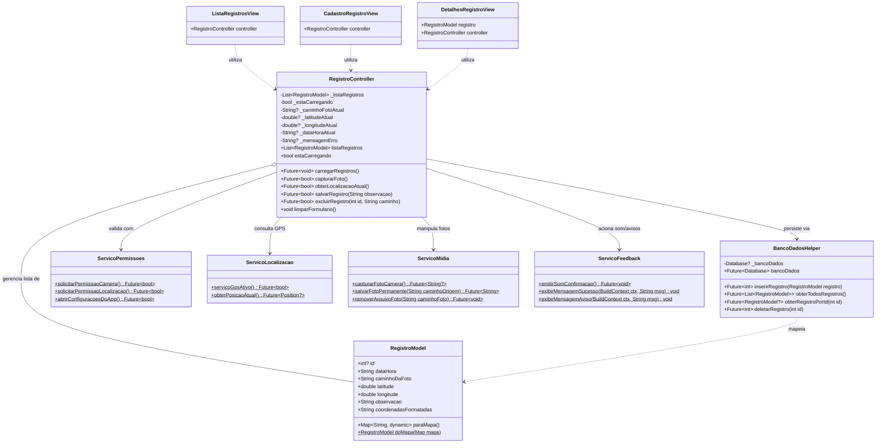
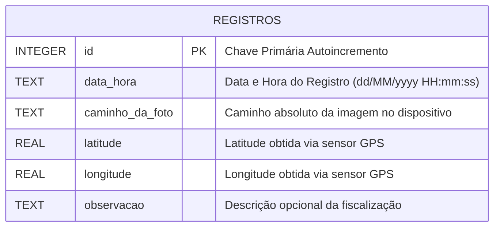
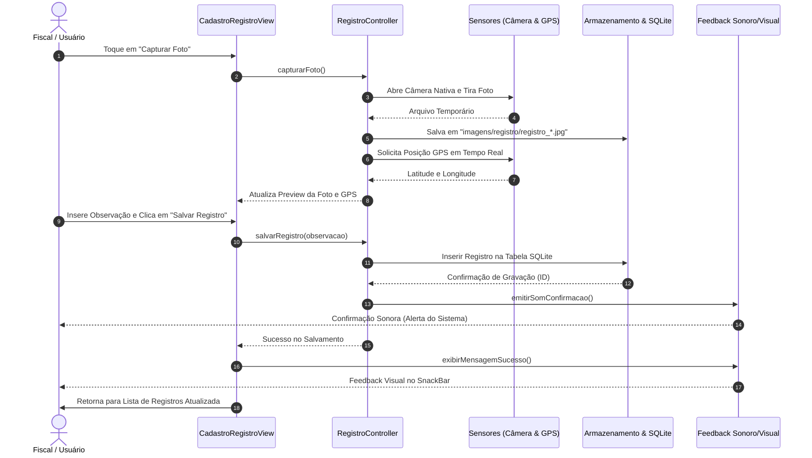

# SENAI CheckIn - Registro de Ponto e Diário de Campo com Foto e GPS

**Autor:** Thayssa Maneo  
**Padrão Internacional:** ISO/IEC/IEEE 29148:2018  
**Versão:** 1.0.0  
**Data:** 17/09/2026  

---

## 1. Introdução

### 1.1 Objetivo:

O projeto SENAI CheckIn tem como objetivo criar um aplicativo móvel para que cada visita de fiscalização e atendimento externo do SENAI seja validado com dados reais de localização e documentação visual. 

### 1.2 Funções do Sistema
Ao registrar a presença ou visita em campo, o aplicativo permite:
1. **Obter a localização geográfica exata** em tempo real por meio do sensor GPS do dispositivo móvel.
2. **Capturar foto** do local, colaborador ou atividade através da câmera nativa.
3. **Persistir os dados essenciais** (data/hora, caminho local da foto, latitude, longitude e observações) em banco de dados SQLite local.
4. **Emitir feedback sonoro e visual** imediato confirmando a gravação com sucesso.
5. **Listar e detalhar registros**, com opção de cópia das coordenadas GPS e navegação nos registros salvos.

### 1.3 Páginas do aplicativo

**1. Cadastro de Registro:** Tela para o cadastro das visitas com data/hora, foto, latitude, longitude e observação.

**2. Lista de Registro:** Tela para visualização dos registros feitos.

**3. Detalhes do item:** Tela para visualização dos detalhes do registro feito.

### 1.4 Bibliotecas utilizadas:

1. GPS (GeoLocator)
2. Câmera (image_picker)
3. SQLite (sqflite)

## 2. Requisitos do sistema

### 2.1 Requisitos Funcionais

| ID | Requisito | Descrição |
| --- | --- | --- |
| **RF-01** | Capturar foto | O sistema deve permitir que o usuário capture uma foto registrando sua visita a partir da câmera nativa. |
| **RF-02** | Obter localização | O sistema deve obter automaticamente a latitude e longitude exatas via GPS. |
| **RF-03** | Registrar observação | O sistema deve permitir a digitação de notas e observações sobre a visita. |
| **RF-04** | Salvar registro | O sistema deve salvar o caminho da foto, data/hora, latitude, longitude e observação no banco SQLite local. |
| **RF-05** | Confirmar salvamento | O sistema deve emitir confirmação visual (SnackBar) e sonora após a persistência do registro. |
| **RF-06** | Listar registros | O sistema deve exibir uma lista ordenada com os registros cadastrados e suas miniaturas. |
| **RF-07** | Detalhar registro | O sistema deve exibir os detalhes completos de uma fiscalização ao tocar no item da lista. |
| **RF-08** | Excluir registro | O sistema deve permitir a exclusão de um registro do banco e a remoção física do arquivo da foto. |

### 2.2 Requisitos Não Funcionais

| ID | Requisito | Descrição |
| --- | --- | --- |
| **RNF-01** | Desempenho | O registro com foto e GPS deve ser processado e salvo em até 5 segundos. |
| **RNF-02** | Confiabilidade | O aplicativo deve operar e gravar dados no SQLite mesmo sem sinal de internet (100% offline-first). |
| **RNF-03** | Usabilidade | O fluxo de registro deve ser direto e intuitivo, concluído em poucos toques. |
| **RNF-04** | Segurança | As imagens são salvas em diretório isolado do aplicativo (`imagens/registro`) e as permissões são validadas em tempo de execução. |
| **RNF-05** | Portabilidade | Compatibilidade com sistemas Android e iOS suportados pelo ecossistema Flutter. |
| **RNF-06** | Manutenibilidade | Código limpo, modularizado em camadas MVC e com funções curtas aderentes ao SOLID. |

---

## 3. Diagramas do Sistema

### 3.1 Diagrama de Classes UML (Padrão MVC)



---

### 3.2 Diagrama de Casos de Uso

```mermaid
flowchart LR
    Fiscal([👤 Fiscal / Usuário])

    subgraph SENAI CheckIn
        UC1([Capturar Foto com Câmera])
        UC2([Obter Coordenadas GPS])
        UC3([Cadastrar Novo CheckIn])
        UC4([Listar Visitas Realizadas])
        UC5([Visualizar Detalhes do Registro])
        UC6([Copiar Coordenadas GPS])
        UC7([Excluir Registro])
        UC8([Conceder Permissões em Tempo de Execução])
    end

    Fiscal --> UC4
    Fiscal --> UC3
    Fiscal --> UC5
    Fiscal --> UC7

    UC3 ..> UC1 : <<include>>
    UC3 ..> UC2 : <<include>>
    UC1 ..> UC8 : <<requires>>
    UC2 ..> UC8 : <<requires>>
    UC5 ..> UC6 : <<extend>>
```

---

### 3.3 Diagrama Entidade-Relacionamento do Banco SQLite



---

### 3.4 Diagrama de Sequência: Fluxo de Registro



---

## 4. Tutorial: Como Executar o App pelo Repositório GitHub

Siga os passos abaixo para clonar o repositório, instalar as dependências e executar o aplicativo em seu ambiente de desenvolvimento.

### 4.1 Pré-requisitos
* **Flutter SDK:** Versão `^3.12.0` ou superior ([Guia de instalação oficial](https://flutter.dev/docs/get-started/install)).
* **Dart SDK:** Incluso na instalação do Flutter.
* **Android Studio** ou **Visual Studio Code** com as extensões do Flutter/Dart configuradas.
* **Dispositivo Físico** (Recomendado para teste real de Câmera e GPS) ou Emulador Android/iOS configurado.
* **Git** instalado no sistema operacional.

---

### 4.2 Passo a Passo de Execução

#### 1. Clonar o Repositório
Abra o terminal e execute o comando:
```bash
git clone https://github.com/seu-usuario/fiscalizacao_somativa.git
```

#### 2. Acessar a Pasta do Projeto
```bash
cd fiscalizacao_somativa
```

#### 3. Obter as Dependências do Flutter
Baixe todas as bibliotecas necessárias declaradas no `pubspec.yaml`:
```bash
flutter pub get
```

#### 4. Executar os Testes Unitários e Análise de Código
Valide a integridade do código e garanta que não há erros de tipagem ou convenções:
```bash
flutter analyze
flutter test
```

#### 5. Executar o Aplicativo
Conecte seu dispositivo móvel com a Depuração USB ativada (ou inicie o emulador) e execute:
```bash
flutter run
```

---

### 4.3 Configuração de Permissões no Primeiro Uso

1. Ao abrir o aplicativo pela primeira vez e tocar no botão **"Novo CheckIn"**:
   * O sistema solicitará permissão de **Câmera**: escolha **"Permitir"**.
   * O sistema solicitará permissão de **Localização**: selecione **"Permitir durante o uso do app"**.
2. Caso alguma permissão seja recusada permanentemente, o aplicativo exibirá um diálogo com orientações e um botão de acesso direto às configurações do aparelho.